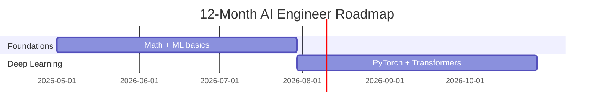

# claudemap-coach

> Turn any career or learning goal into a personalized, trend-aware roadmap — right inside Claude Code.

**Status:** Pre-release — under active development.

---

## Why use this

Most career and learning advice is generic, outdated, or buried in 30 browser tabs. `claudemap-coach` gives you a **personalized roadmap** in a single conversation — informed by current industry trends, sanity-checked by an expert reviewer, and structured so you can actually execute it week by week.

### What you get

- **A guided conversation, not a form.** The coach asks a handful of focused questions about where you are, where you want to be, and what you can realistically commit. No filling out a 50-field profile.
- **Roadmaps grounded in what's actually happening _right now_** — not what was true two years ago. Skills, tools, and resources are pulled from the current state of the field, with reference links you can click.
- **An expert-quality second opinion.** Your draft is reviewed for realism, gaps, and currency by an automated specialist tuned to your topic — so you don't ship a plan with a six-month detour into a deprecated framework.
- **Living, not static.** Track progress as you go. Refresh the roadmap when the field moves. Re-review on demand.
- **Beautiful, version-controllable output.** A clean markdown file with an embedded Mermaid timeline you can read in any editor, render on GitHub, or paste into a notebook.

---

## Commands

| Command | What it does |
|---|---|
| `/claudemap-coach:create <topic>` | Start a new roadmap. The coach interviews you, researches the field, drafts the plan, and reviews it before saving. |
| `/claudemap-coach:update [path]` | Walk through your milestones and mark progress. The roadmap updates itself. |
| `/claudemap-coach:refresh [path]` | Bring an existing roadmap up to date with the latest trends, tools, and resources. |
| `/claudemap-coach:review [path]` | Get a fresh expert review of an existing roadmap, with no edits applied. |

---

## Quick start

Once published:

```bash
claude plugin install Y-Bro/claudemap-coach
```

Then in Claude Code:

```
/claudemap-coach:create AI Engineer
```

Answer a few questions and the coach takes it from there. A first run typically takes 5–10 minutes of light back-and-forth.

---

## Example topics it handles well

- _"Become an AI Engineer in 12 months — I'm a Java backend dev with 3 years of experience."_
- _"Go from 20 LPA to 50 LPA as a SWE in India over the next 18 months."_
- _"Master Rust async by end of year. I have 8 hours a week."_
- _"Move from IC senior to engineering manager."_
- _"Pass the AWS Solutions Architect Pro exam in 3 months."_

---

## What a roadmap looks like

````markdown
# Roadmap: Backend SWE → AI Engineer (12 months)

## Overview
12 hours/week · $200/yr resource budget · current state: 3 yrs Java backend.
Target: junior–mid AI Engineer at a Series B+ startup or large tech.

## Phase 1 (Months 1–3): Foundations
- [ ] Linear algebra essentials — [3Blue1Brown Essence of Linear Algebra](https://www.3blue1brown.com/topics/linear-algebra)
- [ ] Probability + statistics primer — [StatQuest playlist](https://www.youtube.com/...)
- [ ] Build: implement gradient descent from scratch in NumPy
- ✅ Success criterion: pass fast.ai Practical Deep Learning lesson 1 quiz

## Phase 2 (Months 4–6): Modern Deep Learning
...


````

Roadmaps are saved as plain markdown to `~/claudemap/<slug>.md`. Open them in any editor, commit them to your own git repo, share them with a mentor, paste them into Notion — they're just files.

---

## Scope

**Great for**

- Career transitions (role changes, level jumps, target compensation).
- Learning a specific skill, language, framework, or tool.
- Certification or exam prep.

**Not for**

- Life-coaching topics (fitness, relationships, finance).
- Shipping software — use `superpowers:writing-plans` for implementation plans.
- Team or product planning.

---

## Configuration

| Setting | Default | Purpose |
|---|---|---|
| `claudemapDir` | `~/claudemap` | Where roadmaps and progress files are stored |

Set it through your Claude Code plugin configuration. You can also pass an explicit file path to any of the `update` / `refresh` / `review` commands.

---

## Cost & transparency

Each command prints a short usage summary at the end so you can see exactly what the run cost. Nothing is sent anywhere — no analytics, no telemetry, no cloud. Your roadmaps live on your machine.

---

## Roadmap (the meta one)

- [ ] First public release
- [ ] Marketplace listing
- [ ] Example gallery (sample roadmaps for common goals)
- [ ] Optional GitHub-rendered live demo

---

## License

MIT (planned)

---

## Author

[Bharath Yerrumsetty](https://github.com/Y-Bro) · [github.com/Y-Bro/claudemap-coach](https://github.com/Y-Bro/claudemap-coach)
