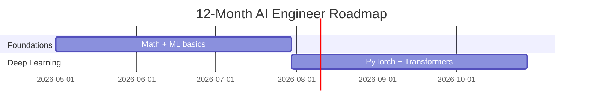

# claudemap-coach

> Turn any career or learning goal into a personalized, trend-aware roadmap — right inside Claude Code.

`v0.5.0` · Soft launch · MIT licensed

---

## Why use this

Most career and learning advice is generic, outdated, or buried in 30 browser tabs. `claudemap-coach` gives you a **personalized roadmap** in a single conversation — informed by current industry trends, sanity-checked by an expert reviewer, and structured so you can actually execute it week by week.

### What you get

- **A guided conversation, not a form.** The coach asks a handful of focused questions about where you are, where you want to be, and what you can realistically commit. No filling out a 50-field profile.
- **Roadmaps grounded in what's actually happening _right now_** — not what was true two years ago. Skills, tools, and resources are pulled from the current state of the field, with reference links you can click.
- **An expert-quality second opinion.** Your draft is reviewed for realism, gaps, and currency by an automated specialist tuned to your topic — so you don't ship a plan with a six-month detour into a deprecated framework.
- **Living, not static.** Track progress as you go. Refresh the roadmap when the field moves. Re-review on demand.
- **Beautiful, version-controllable output.** A clean markdown file with an embedded Mermaid timeline you can read in any editor, render on GitHub, or paste into a notebook.

---

## Commands

| Command | What it does |
|---|---|
| `/claudemap-coach:create <topic>` | Start a new roadmap. The coach interviews you, researches the field, drafts the plan, and reviews it before saving. |
| `/claudemap-coach:update [path]` | Walk through your milestones and mark progress. The roadmap updates itself. |
| `/claudemap-coach:refresh [path]` | Bring an existing roadmap up to date with the latest trends, tools, and resources. |
| `/claudemap-coach:review [path]` | Get a fresh expert review of an existing roadmap, with no edits applied. |

---

## Installation

`claudemap-coach` is a Claude Code plugin, distributed through this repo's plugin marketplace. Install it from inside a Claude Code session in two steps.

**Prerequisites:** any current version of [Claude Code](https://docs.claude.com/en/docs/claude-code/overview). No flags or settings to flip.

**1. Add the marketplace** (one-time, per machine):

```
/plugin marketplace add Y-Bro/claudemap-coach
```

**2. Install the plugin:**

```
/plugin install claudemap-coach@Y-Bro/claudemap-coach
```

That's it — the four `/claudemap-coach:*` commands are now available.

> Prefer a UI? Run `/plugin`, open **Discover**, find _claudemap-coach_, and install interactively. Useful if you want to pick install scope (user vs. project).

To upgrade later, run `/plugin marketplace update Y-Bro/claudemap-coach` and reinstall. To remove it, `/plugin uninstall claudemap-coach`.

---

## How to use it

### Create your first roadmap

```
/claudemap-coach:create AI Engineer
```

The topic is freeform — pass anything from a job title to a specific skill (`/claudemap-coach:create Master Rust async`). What happens next:

1. **Save location prompt.** You pick where the roadmap file lives — your current directory, the global library at `~/claudemap/`, or a custom path.
2. **Discovery conversation.** A handful of focused questions about your starting point, target, time budget, and constraints. Usually 5–8 turns.
3. **Research pass.** The coach pulls current tools, resources, and trends for your topic, with reference links.
4. **Drafting.** A phased roadmap with milestones, success criteria, and a Mermaid timeline.
5. **Expert review.** A specialist reviewer sanity-checks the draft for realism, gaps, and outdated content. Edits are applied automatically.
6. **Save.** The final file is written to the location you chose. Open it in any editor or render it on GitHub.

A first run takes 5–10 minutes of light back-and-forth.

### Maintain it over time

Once you have a roadmap file, the other three commands keep it useful:

```
/claudemap-coach:update                 # walk through milestones, mark progress
/claudemap-coach:refresh                # pull in new tools, resources, trends
/claudemap-coach:review                 # fresh expert review, no edits applied
```

Each opens with the same save-location prompt so it can find your roadmap. To skip the prompt, pass an explicit path:

```
/claudemap-coach:update ~/claudemap/ai-engineer.md
```

---

## Example topics it handles well

- _"Become an AI Engineer in 12 months — I'm a Java backend dev with 3 years of experience."_
- _"Go from 20 LPA to 50 LPA as a SWE in India over the next 18 months."_
- _"Master Rust async by end of year. I have 8 hours a week."_
- _"Move from IC senior to engineering manager."_
- _"Pass the AWS Solutions Architect Pro exam in 3 months."_

---

## What a roadmap looks like

````markdown
# Roadmap: Backend SWE → AI Engineer (12 months)

## Overview
12 hours/week · $200/yr resource budget · current state: 3 yrs Java backend.
Target: junior–mid AI Engineer at a Series B+ startup or large tech.

## Phase 1 (Months 1–3): Foundations
- [ ] Linear algebra essentials — [3Blue1Brown Essence of Linear Algebra](https://www.3blue1brown.com/topics/linear-algebra)
- [ ] Probability + statistics primer — [StatQuest playlist](https://www.youtube.com/...)
- [ ] Build: implement gradient descent from scratch in NumPy
- ✅ Success criterion: pass fast.ai Practical Deep Learning lesson 1 quiz

## Phase 2 (Months 4–6): Modern Deep Learning
...


````

Roadmaps are saved as plain markdown to `~/claudemap/<slug>.md`. Open them in any editor, commit them to your own git repo, share them with a mentor, paste them into Notion — they're just files.

---

## Scope

**Great for**

- Career transitions (role changes, level jumps, target compensation).
- Learning a specific skill, language, framework, or tool.
- Certification or exam prep.

**Not for**

- Life-coaching topics (fitness, relationships, finance).
- Shipping software — use `superpowers:writing-plans` for implementation plans.
- Team or product planning.

---

## Configuration

| Setting | Default | Purpose |
|---|---|---|
| `claudemapDir` | `~/claudemap` | Default location for the **Global library** option in the save-location prompt |

You don't have to set this — every command opens with a three-option location prompt (current directory, global library, custom path). `claudemapDir` only changes what "global library" resolves to. You can also pass an explicit file path to any of the `update` / `refresh` / `review` commands to skip the prompt entirely.

---

## Cost & transparency

Each command prints a short usage summary at the end so you can see exactly what the run cost. Nothing is sent anywhere — no analytics, no telemetry, no cloud. Your roadmaps live on your machine.

---

## Roadmap (the meta one)

- [x] First soft-launch release (`v0.5.0`)
- [ ] Listing in the official Claude Code plugin marketplace
- [ ] Example gallery (sample roadmaps for common goals)
- [ ] Demo recording (asciinema or GIF)
- [ ] `1.0.0` after the first external user has a clean end-to-end run

---

## Contributing

Bug reports, feature requests, and PRs welcome. See [CONTRIBUTING.md](CONTRIBUTING.md) for development setup and the contribution flow, and [SECURITY.md](SECURITY.md) for vulnerability disclosure.

---

## License

[MIT](LICENSE)

---

## Author

[Bharath Yerrumsetty](https://github.com/Y-Bro) · [github.com/Y-Bro/claudemap-coach](https://github.com/Y-Bro/claudemap-coach)
